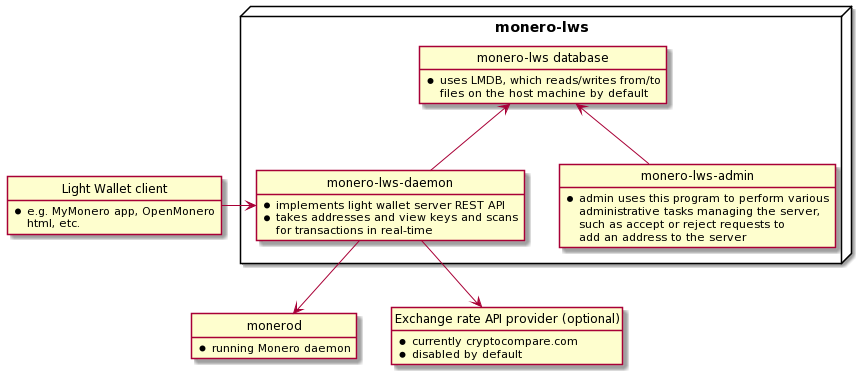

## Overview

This review is meant to serve as an informal audit of `monero-lws` as of
February 3, 2022. It is divided into 3 parts:

1. How does `monero-lws` work?
2. The code
3. Suggestions

It was put together as part of [a CCS proposal](https://ccs.getmonero.org/proposals/j-berman-3-months-full-time.html)
with the intention of getting `monero-lws` further along (and potentially 
included in the [Monero project github](https://github.com/monero-project)).

Note that this report does not contain documentation for all code in
`monero-lws`, and has to-do's for a number of folders and files. 

In my review, I did not find anything that would compromise `monero-lws` when
examining from the lens of the following threat model:

```
A user who is running `monerod` + `monero-lws` on a machine only the user has 
access to does not leak any information about their Monero transactions to a 3rd 
party through normal usage. Examples of leaks would be:

- a backdoor that sends sensitive data from `monero-lws` out to a 3rd party
- `get_random_outs` responds with decoys that compromise the user's transactions 
when stored on chain
- calls to the exchange rate API reveal information to the service provider
```

Disclaimer: I wouldn't call this audit definitively conclusive that the above
threat model is successfully defended, but I hope that it does inspire more
confidence in this fine piece of software, and serves as a useful document for
curious users, potential contributors, or any future auditors of `monero-lws`.
I reviewed (and tried to provide documentation for) nooks and crannies across
the code, and so at the very least can say with confidence there aren't any
obvious backdoors.

## How does `monero-lws` work?

Monero wallets need to scan all transactions in the blockchain to find which 
ones belong to a user. `monero-lws` ("Monero light wallet server") is designed 
to offload scanning for a user's transactions from the client to a server. As 
stated in the [README.md](/README.md), it is an implementation of the 
[Monero light wallet REST API](https://github.com/monero-project/meta/blob/master/api/lightwallet_rest.md), and is therefore compatible with e.g. a 
[MyMonero frontend](https://github.com/mymonero/mymonero-app-js). A user may use
a MyMonero app (or any other compatible frontend) to connect with their own
running `monero-lws` instance, so that when the user revisits the app, the app
is immediately ready to use for spending. `monero-lws` works by taking in a 
user's address and view key, and perpetually scanning for transactions received
and plausibly spent by the user.

The primary risk to a user using `monero-lws` as their backend is that the
device where it runs is an additional target for someone malicious to compromise
a user's privacy. A user should assume that someone with access to wherever the 
`monero-lws` backend is hosted will be able to determine all outputs received to
the user, and in most cases today, the outputs spent by the user as well. This
also includes **amounts** received to and spent by the user. If a `monero-lws` 
instance is compromised, user funds are still SAFU since the private spend key
is never sent to `monero-lws`. Ongoing research may improve this risk profile
further, but the above should be users' default assumptions today.

Whoever hosts a `monero-lws` instance can run the server via the
`monero-lws-daemon` as described in the [README.md](/README.md#running-monero-lws-daemon)
("Running monero-lws-daemon"). The daemon is expected to run 24/7 and
perpetually scan for transactions recevied to (and plausibly spent from) the
addresses known to the server in real-time.

Whoever hosts a `monero-lws` instance can perform administrative tasks via the
`monero-lws-admin` program, as described in
[administration.md](/docs/administration.md). The `monero-lws-daemon` does not
need to be running in order for the admin to execute commands via
`monero-lws-admin`.

Both `monero-lws-daemon` and `monero-lws-admin` read/write from/to an LMDB
database on the same machine hosting `monero-lws`.

`monero-lws-daemon` can also fetch exchange rates from a 3rd party API provider
if an administrator wants. This is turned off by default.

Here is a simplified diagram of the `monero-lws` architecture:

<br/>
<p align="center"></p>
<br/>

In the [next section](#the-code), the code will be explained folder-by-folder,
file-by-file, and in some cases where appropriate, function-by-function. The
[final section](#areas-worth-exploring) will highlight suggestions to
potentially improve `monero-lws`.

## The code

### /src

This is where the source code lives. The starter file for `monero-lws-daemon` is
[/src/server_main.cpp](/src/server_main.cpp). The starter file for
`monero-lws-admin` is [/src/admin_main.cpp](/src/admin_main.cpp). Both use
a lot of shared code across the repo.

#### /src/server_main.cpp

Starts in `main()` initializing logs and loading tools, then passes command line
args to a function `get_program()` to parse the args and construct the program
to run. The resulting program is then passed to `run()`. Failures are caught 
gracefully.

Passing `--help` to `monero-lws-daemon` is the one exception that does not run
a program, and instead outputs the following (note the configurable defaults):

```
Usage: [options]
Options:
  --db-path arg (=~/.bitmonero/light_wallet_server)
                                        Folder for LMDB files
  --network arg (=main)                 <"main"|"stage"|"test"> - Blockchain 
                                        net type
  --help                                Produce help message
  --daemon arg (=tcp://127.0.0.1:18082) <protocol>://<address>:<port> of a 
                                        monerod ZMQ RPC
  --sub arg                             tcp://address:port or ipc://path of a 
                                        monerod ZMQ Pub
  --rest-server arg (=https://0.0.0.0:8443)
                                        [(https|http)://<address>:]<port> for 
                                        incoming connections, multiple 
                                        declarations allowed
  --rest-ssl-key arg                    <path> to PEM formatted SSL key for 
                                        https REST server
  --rest-ssl-certificate arg            <path> to PEM formatted SSL certificate
                                        (chains supported) for https REST 
                                        server
  --rest-threads arg (=1)               Number of threads to process REST 
                                        connections
  --scan-threads arg (=8)               Maximum number of threads for account 
                                        scanning
  --access-control-origin arg           Specify a whitelisted HTTP control 
                                        origin domain
  --confirm-external-bind               Allow listening for external 
                                        connections
  --create-queue-max arg (=10000)       Set pending create account requests 
                                        maximum
  --exchange-rate-interval arg (=0)     Retrieve exchange rates in minute 
                                        intervals from cryptocompare.com if 
                                        greater than 0
  --log-level arg (=1)                  Log level [0-4]
```

Note that `scan-threads` defaults to the maxmimum number of available threads
on the host machine.

Also note that the `rest-server` defaults to being served over https.

Here are sample logs when you start the default program with `log-level` 4.

```
2022-01-11 07:56:42.713	I Using monerod ZMQ RPC at tcp://127.0.0.1:18082
2022-01-11 07:56:42.713	I Starting blockchain sync with daemon
2022-01-11 07:56:42.715	I [PARSE URI] regex not matched for uri: ^((.*?)://)?(\[(.*)\](:(\d+))?)(.*)?
2022-01-11 07:56:42.715	I Binding on 0.0.0.0 (IPv4):8443
2022-01-11 07:56:42.715	I Generating SSL certificate
2022-01-11 07:56:43.092	D start accept (IPv4)
2022-01-11 07:56:43.092	D Spawned connection #0 to 0.0.0.0 currently we have sockets count:1
2022-01-11 07:56:43.092	D test, connection constructor set m_connection_type=1
2022-01-11 07:56:43.092	I Run net_service loop( 1 threads)...
2022-01-11 07:56:43.092	D Run server thread name: NET
2022-01-11 07:56:43.092	D Reiniting OK.
2022-01-11 07:56:43.092	I Listening for REST clients at https://0.0.0.0:8443
```

When `get_program()` calls `run()`, this creates the LMDB environment and 
initializes all tables in the db, syncs `monero-lws` with the running `monerod` 
daemon, subscribes to the monero ZMQ RPC, initializes an http client to query
for exchange rates from cryptocompare.com, initializes the REST server so that
it can start listening for requests, and starts the scanner so that it will 
perpetually scan for users' transactions.

#### /src/rest_server.cpp + /src/rest_server.h

The REST server exposes the following 7 endpoints:

- `/login`
- `/import_wallet_request`
- `/get_address_info`
- `/get_address_txs`
- `/get_random_outs`
- `/get_unspent_outs`
- `/submit_raw_tx`

It handles requests via the function `handle_http_request()`, which does 
standard validation such as whether the endpoint is implemented, if the request 
is appropriately sized (each endpoint has sane default byte size allowances), 
if the request is an HTTP POST request. Then executes the respective endpoint
passing in params included in the request, then handles any errors and responds
accordingly, or returns with a standard success response and body.

##### Authentication

Every endpoint that accepts an `address` and `view_key` as params
(`/login`, `/get_address_info`, `/get_address_txs`, `/get_unspent_outs`, and
`/import_wallet_request`) also enforces that the public view key included in 
the `address` is derived from the private `view_key` provided in the request
(via the `key_check()` function). Additionally, addresses are indexed in the db
by the public view key. Thus, even if the public view key *is* derived from the
private view key, if the public view key is not stored in the db, then the 
response will fail. This way if a malicious user provides an honest user's
public spend key, and also provides a public view key that is derived from some
random private view key, the account would not be found in the db.  This
ensures that only the user with the correct `address` and `view_key` pair 
can access their own data on the server through the REST API.

##### Exchange Rates

`/get_address_info` is the only endpoint that responds with exchange rates iff 
the server has exchange rates enabled. The server serves the latest cached
exchange rates, rather than makes requests to the exchange rate API provider 
every time exchange rates are included in a response. The server requests
exchange rates and caches them in intervals of `exchange-rate-interval`, which 
is an arg the admin can set when starting the `monero-lws-daemon`. This caching
in set intervals strategy is a good privacy-respecting approach, otherwise the 
exchange rate API provider could collect usage stats on how often a user calls 
`/get_address_info`.

##### /login

> Check for the existence of an account or create a new one.

The very first thing done is authentication on the provided `address` and
`view_key` as described above. On failure, it returns `bad_view_key`, which is 
great. Next, it queries the db for the `account` with the given `address`. If
the account is found, it checks if the account has status `hidden`, which is
a status the admin can set via `monero-lws-admin`. If hidden, it will return
`account_not_found`. Otherwise, if it exists, it will simply return with
`create_account` set to false (account was already created), and with whatever
`generated_locally` flag was set at account creation. If the account does not
exist and the user is not attempting to `create_account`, or there was an error
reading the db, then it will return with an error. Finally, if the account does
not already exist, and the user is attempting to `create_account`, then the
server will write a "creation request" to the db, which is just a request to
create an account with that `address` and `view_key` pair (and provided flags).
The admin will need to then manually approve the creation request via
`monero-lws-admin` in order to add the address to the server.

##### /import_wallet_request

> Request an account scan from the genesis block.

This first calls `open_account()`, which authenticates the `address` and
`view_key`, then retrieves the account from the db by address. Just like above,
this function returns with `account_not_found` if hidden or not found, or
returns with the account. If the account's starting scanning height 
(`start_height`) is already 0, then the import request returns as fulfilled. 
Otherwise, it checks for the existence of another import request.
If one already exists, then the endpoint returns saying `Waiting for Approval`.
If not, then it says `Accepted, waiting for approval`.

##### /get_address_info

> Returns the minimal set of information needed to calculate a wallet balance. The server cannot calculate when a spend occurs without the spend key, so a list of candidate spends is returned.

First calls `open_account()`. Then, using the account's unique identifier in the
db, queries for all the user's received outputs and candidate spends. Then
checks the db for the latest height the server knows. Then starts constructing
height metadata for response. Then iterates over all received outputs, collects
spend metadata for each, and totals up `total_received` and `locked_funds`. 
Then iterates over candidate spends, retrieves spend metadata collected in 
prior step, and totals up `total_sent`. Finally, retrieves exchange rates
if the exchange rate interval is set. Then returns the constructed response.

##### /get_address_txs

> Returns information needed to show transaction history. The server cannot calculate when a spend occurs without the spend key, so a list of candidate spends is returned.

First calls `open_account()`. Then queries db for received outputs, candidate
spends, and latest height data. Constructs the same height metadata as above.
Then, iterates over all received and candidates spends at one time, placing
candidate spends in an array inside each received output.

Note there is some more work done before sending the final response over the
wire in `/src/rpc/light_wallet.cpp` that will be explained further later on.

##### /get_random_outs

> Selects random outputs to use in a ring signature of a new transaction. If the `amount` is `0` then the `monerod` RPC `get_output_distribution` should be used to locally select outputs using a gamma distribution as described in "An Empirical Analysis of Traceability in the Monero Blockchain". If the `amount` is not `0`, then the `monerod` RPC `get_output_histogram` should be used to locally select outputs using a triangular distribution (`uint64_t dummy_out = histogram.total * sqrt(float64(random_uint53) / float64(2^53))`).

First, limits requests to a max mixin (ring size) of 50, or max amounts 
requested (the number of different rings) to 20 to avoid overloading the server 
with a single request. Sets up daemon RPC client to query for output data. Then 
for all non-0 amounts, retrieives output histograms and places in an array. A 
relevant query parameter to highlight here is the `recent_cutoff` when 
requesting histograms; the recent cutoff was used in wallet2 to bias toward 
recent outputs when selecting decoys for **pre**-RingCT outputs. However, 
pre-RingCT outputs are infrequent enough today that it should no longer yield 
practical privacy benefits to try and select more recent pre-RingCT outputs in 
higher frequency. Thus, it is ok that `monero-lws` sets this `recent_cutoff` 
param to 0, so that the query wastes no time in factoring in recency for 
pre-RingCT outputs.

After retrieving histograms for pre-RingCT outputs, retrieves the output
distribution of RingCT outputs across the whole chain (if 0 amount outputs 
are requested). This distribution is later passed into a `lws:gamma_picker` 
declaration, where it's used to select RingCT decoys. 

Then sets up a constructor to fetch output public keys over RPC (accepts output
id's as param).

Final step, the function passes in all data (and fetch function) needed
to actually make decoy selections from the distribution/histograms. This
function is called `pick_random_outputs` and will be explained in greater
detail later.

The response from `pick_random_outputs` is the final response to 
`/get_random_outs`.

Note: it should be noted here that any server that records the selected decoys 
and cross-references them with the outputs included in a transaction can easily 
tell which output is real (the one not included as a decoy in the response).
Thus, a user should expect that if they are using a light wallet server to
construct transactions, the server can trivially tell which outputs are
spent in the user's transactions, no heuristics needed.

##### /get_unspent_outs

> Returns a list of received outputs. The client must determine when the output was actually spent.

First calls `open_account()`. Then makes an RPC request to `monerod` for the
dynamic fee estimate. A relevant query parameter to highlight here is
`num_grace_blocks`, which is the
["number of blocks we want the fee to be valid for"](https://github.com/monero-project/monero/blob/298c9a357f6e57eccf28db1f3e734eb6da080d9a/src/cryptonote_core/blockchain.h#L646).
It is set to `10`, which matches [wallet2](https://github.com/monero-project/monero/blob/319b831e65437f1c8e5ff4b4cb9be03f091f6fc6/src/wallet/wallet2.cpp#L118).
It is important this estimate matches what other Monero ecosystem users would 
use, since if the fee were different, it would cause transactions constructed
with the different fee to be fingerprintable. Thus, matching `num_grace_blocks`
is good.

The endpoint then gets all of a user's received outputs and for all outputs that 
are >= requested `dust_threshold`, or are in tx's with ring sizes >= requested 
`mixin_count`, gets their associated key images, then tacks the final `output` 
object onto what will eventually become the `outputs` array in the response.

Finally, calculates the `per_kb_fee` factoring in `size_scale` and `fee_mask`
returned by the daemon. Note that `per_kb_fee` has been deprecated in the
light wallet REST API, and this should be updated to `per_byte_fee`. See [this
issue](https://github.com/vtnerd/monero-lws/issues/25) for more.

Note there is some more work done before sending the final response over the
wire in `/src/rpc/light_wallet.cpp` that will be explained further later on.

##### /submit_raw_tx

> Submit raw transaction to be relayed to monero network.

Very simple. Just relays the transaction over the daemon RPC `send_raw_tx_hex`
endpoint. Returns error if not relayed successfully.

#### /src/scanner.cpp + /src/scanner.h

This code handles scanning the blockchain for users' transactions while 
`monero-lws-daemon` is running. It makes sure `monero-lws` is in sync with the
chain, stays in sync, and just keeps scanning all the time.

##### lws::scanner::stop()

Stops the scanner, naturally.

Sets the `monero-lws-daemon`'s `running` state to false. It is called from
`server_main.cpp`, which is listening for a SIGINT signal in order to trigger
`lws::scanner::stop()`.

##### lws::scanner::sync()

Syncs the running `monero-lws-daemon` with the blockchain, making sure 
`monero-lws-daemon` knows what blocks still need to be scanned.

First thing this function does is reads the `monero-lws` db to find the most
recent known block hashes. Then it requests block hashes from the running
`monerod` daemon via RPC endpoint `/get_hashes_fast`, providing the known hashes
as a param. Uses while loops to wait on daemon response and times out or exits
if admin signals to end the program via SIGINT. Once daemon returns the
response, if the daemon has already synced to the top of the chain, the `sync()`
function returns successfully. If not, writes the returned new hashes to the
`monero-lws` db, and rolls back/updates the chain if a reorg has been detected.
If there are still more hashes to request from the daemon, continues loop
requesting from the daemon. Otherwise, breaks and the function returns.

##### lws::scanner::run()

Runs the scanner in a perpetual loop, so that it continues scanning for users' 
transactions while `monero-lws-daemon` is running. Also updates exchange rates
held in the cache.

First retrieives all active accounts and their received outputs from the 
`monero-lws` db. If no active accounts, sleeps for a bit. Otherwise, proceeds
to scan for transactions for all active accounts inside `check_loop()`. Then,
checks if the scanner has stopped and should exit `run()`, otherwise continues.
Next initializes an rpc client connection to the daemon if one already not
initialized. Then calls `lws::scanner::sync()` to make sure `monero-lws` is
still in sync with `monerod`. Finally, if there is a sync error that is not a
timeout, throws; if not timeout, warns in a log. Continues looping until
there are users to scan transactions for.

###### check_loop()

Relevant comments:

> Launches `thread_count` threads to run `scan_loop`, and then polls for active account changes in background

```
The algorithm here is extremely basic. Users are divided evenly amongst
the configurable thread count, and grouped by scan height. If an old
account appears, some accounts (grouped on that thread) will be delayed
in processing waiting for that account to catch up. Its not the greatest,
but this "will have to do" for the first cut.
Its not expected that many people will be running
"enterprise level" of nodes where accounts are constantly added.

Another "issue" is that each thread works independently instead of more
cooperatively for scanning. This requires a bit more synchronization, so
was left for later. Its likely worth doing to reduce the number of
transfers from the daemon, and the bottleneck on the writes into LMDB.

If the active user list changes, all threads are stopped/joined, and
everything is re-started.
```

Exactly as described, the first thing it does is sorts all users by 
`scan_height`, so that it can send batches of users at a time into threads
that execute `scan_loop()` over those users (so that users with similar heights
are processed together). Then it enters a while loop that updates exchange rates
over the exchange rate interval, and then perpetually checks for changes to
the users stored in the `monero-lws` db. If it finds that there is a change
in active users stored, `check_loop()` returns so that `lws::scanner::run()`
can do another loop, collecting all active users again and re-entering
`check_loop()` with the updated list.

###### scan_loop()

TO-DO

#### /src/admin_main.cpp

#### /src/CMakeLists.txt

#### /src/config.cpp

#### /src/config.h

#### /src/error.cpp

#### /src/error.h

#### /src/fwd.h

#### /src/options.h

#### /src/wire.h

#### /src/db

##### /src/db/account.cpp

##### /src/db/account.h

##### /src/db/CMakeLists.txt

##### /src/db/data.cpp

##### /src/db/data.h

##### /src/db/fwd.h

##### /src/db/storage.cpp

##### /src/db/storage.h

##### /src/db/string.cpp

##### /src/db/string.h

#### /src/rpc

##### /src/rpc/client.cpp

##### /src/rpc/client.h

##### /src/rpc/CMakeLists.txt

##### /src/rpc/daemon_pub.cpp

##### /src/rpc/daemon_pub.h

##### /src/rpc/daemon_zmq.cpp

##### /src/rpc/daemon_zmq.h

##### /src/rpc/fwd.h

##### /src/rpc/json.h

##### /src/rpc/ligt_wallet.cpp

##### /src/rpc/ligt_wallet.h

##### /src/rpc/rates.cpp

##### /src/rpc/rates.h

#### /src/util

#### /src/wire

### /CMakeLists.txt

## Suggestions

- Consider indexing addresses by a hash of the private view key instead of just
public view key, so that timing analysis under perfect conditions cannot reveal
whether an address is stored.

- See the current state of subaddress support
[over here](https://github.com/monero-project/meta/pull/647).

- Share a guide on hosting `monero-lws` behind a .onion, and enable a frontend
to make calls to it.

- The exchange rate API defaults to off. When turned on, it fetches prices in a
custom interval over the clearnet. `monero-lws` could be bundled with tor or
another anonymity network, so that queries for exchange rates are made over the
anonymity network by default.

- Consider suggesting a particular interval to admins who wish to turn on the
exchange rate interval or requiring intervals at particular windows (e.g. 10 
seconds, 30 seconds, 60 seconds, etc.), to prevent an admin from fingerprinting 
themselves via the exchange rate interval they choose to set.

- Allow users to add addresses and import requests in a secure way without 
needing manual input from the admin, for example, by using a special auth token
(or username/password combo) that allows a user to make as many requests as   
they want (or comes with special rules). This minimizes need for out-of-band 
solutions to automate this process in a potentially insecure way (e.g. 
auto-accepting all requests).

- Be mindful that even if an account has a `hidden` status, someone would be
able to still tell that account is stored on the server since `/login` will
always return `account_not_found`, even if trying to create the account. This
is not a big deal, because you'd need the `address` and `view_key` to be able
to reach this point. Just worth being mindful of.
